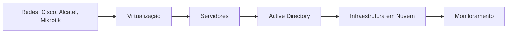

<h1 align="center">Intermediário Infraestrutura</h1>

## Bem-vindo(a) à jornada de aprendizado intermediária em Infraestrutura de TI!  
&nbsp;&nbsp;&nbsp;&nbsp;Essa trilha foi criada para quem já tem uma base em Infraestrutura e quer aprimorar suas habilidades em redes, virtualização, sistemas operacionais, monitoramento e nuvem. Aqui você terá acesso a cursos especializados em equipamentos Cisco, Alcatel, Mikrotik, além de explorar ferramentas de virtualização, servidores, Active Directory e soluções de monitoramento. Vamos também mergulhar nas infraestruturas em nuvem para te preparar para os desafios do mercado.  
&nbsp;&nbsp;&nbsp;&nbsp;Ao final desta trilha, você terá uma visão mais aprofundada da área e poderá aplicar esses conhecimentos em ambientes reais.

# Intermediário

1. **Redes: Cisco, Alcatel e Mikrotik**  
   ** Cisco e Alcatel**
   Configuração de switches, roteadores e firewalls, utilizando equipamentos Cisco e Alcatel para redes corporativas.  
   [Cisco Networking Academy](https://www.netacad.com/courses)  
   **OU**
   
   **Mikrotik: Switches e AP**  
   Configuração e gerenciamento de switches e pontos de acesso Mikrotik.   
   [Mikrotik MTCNA](https://www.mikrotik.com/training)  

3. ** Virtualização (VMware e Hyper-V)**  
   ** VMware vSphere: Instalando e Configurando**  
   Curso para aprender a configurar e gerenciar máquinas virtuais utilizando VMware.  
   [VMware vSphere](https://www.vmware.com/education-services/certification/vsphere.html)  

   **OU**

   **Hyper-V para Administradores de TI**
   Curso sobre a instalação, configuração e gerenciamento de máquinas virtuais com Hyper-V.  
   [Hyper-V](https://learn.microsoft.com/pt-br/virtualization/hyper-v-on-windows/)

4. **Sistemas Operacionais (Linux Server e Windows Server)**
   **Linux Essentials | Linux Academy**  
   Curso essencial sobre administração de servidores Linux, incluindo instalação, configuração e manutenção.  
   [Linux Server](https://www.linuxacademy.com)

   **&**

   **Administração de Windows Server | Udemy**  
   Curso focado na instalação, configuração e administração de Windows Server, incluindo Active Directory e políticas de grupo.  
   [Windows Server](https://www.udemy.com/course/administracao-windows-server/)
   
   **&**

   **Introdução ao Active Directory**  
   Curso sobre criação e gerenciamento de usuários, grupos e políticas de segurança com Active Directory.  
   [Windows AD](https://learn.microsoft.com/pt-br/)

5. ** Infraestrutura em Nuvem (AWS e Microsoft Azure)**
   **AWS Essentials | AWS Training**  
   Curso para entender os fundamentos da AWS, criação de instâncias e gerenciamento de serviços.  
   [AWSi](https://aws.amazon.com/training/)
   
   **OU**

   **Microsoft Certified: Azure Fundamentals**  
   Curso básico sobre a plataforma de nuvem da Microsoft, desde a criação de máquinas virtuais até os serviços de armazenamento e rede.  
   [Azure](https://learn.microsoft.com/pt-br/certifications/azure-fundamentals/)

6. ** Monitoramento (Zabbix e Grafana)**
   **Zabbix**
   Curso sobre a instalação e configuração do Zabbix para monitoramento de servidores e serviços.  
   [Zabbix](https://www.zabbix.com/documentation/current/manual/)

   **&**

   **Grafana**
   Curso sobre a criação de dashboards de monitoramento e visualização de dados com Grafana.  
   [Grafana](https://grafana.com/docs/grafana/latest/)

---

## O que você deve saber ao final dessa trilha:

- **Redes Avançadas com Cisco, Alcatel e Mikrotik**  
   Capacidade de configurar e administrar switches, roteadores e APs Mikrotik, Cisco e Alcatel.

- **Virtualização com VMware e Hyper-V**  
   Habilidade de configurar e gerenciar máquinas virtuais em ambientes corporativos, utilizando VMware e Hyper-V.

- **Administração de Servidores Linux e Windows Server**  
   Conhecimento na instalação, configuração e manutenção de servidores Linux e Windows, com foco em gerenciamento de usuários e segurança.

- **Gerenciamento de Active Directory**  
   Habilidade de criar e gerenciar ambientes AD, incluindo políticas de segurança e gerenciamento de usuários e grupos.

- **Infraestrutura em Nuvem com AWS e Azure**  
   Capacidade de criar e gerenciar instâncias e serviços em nuvem usando AWS e Microsoft Azure.

- **Monitoramento com Zabbix e Grafana**  
   Conhecimento para implementar soluções de monitoramento eficazes para servidores e serviços, utilizando Zabbix e Grafana.

---

## Profissões que você pode seguir após essa trilha:

- Administrador de Redes
- Analista de Infraestrutura
- Engenheiro de Nuvem
- Analista de Suporte Nível 2
- Administrador de Sistemas
- Especialista em Monitoramento

---

## Livros e Materiais Sugeridos

**Redes de Computadores – Andrew Tanenbaum**  
↳ [Link Amazon](https://www.amazon.com.br/Redes-Computadores-Andrew-Tanenbaum/dp/8535245056)

**Active Directory: Guia de Referência**  
↳ [Link Amazon](https://www.amazon.com.br/Active-Directory-Guia-Refer%C3%AAncia/dp/8574527109)

**Linux Server - O Guia Completo**  
↳ [Link Amazon](https://www.amazon.com.br/Linux-Server-Guia-Completo/dp/8535245022)

**Grafana - Visualize e Monitore seus Dados**  
↳ [Link Amazon](https://www.amazon.com.br/Grafana-Visualize-Monitore-seus-Dados/dp/8597011005)

---
## Orientações Finais
&nbsp;&nbsp;&nbsp;&nbsp;Após concluir os cursos, não deixe de realizar os exercícios. Temos um servidor exclusivo para Redes. Se você tem interesse em participar, cadastre-se em nosso site e em seguida, fala o laboratório do módulo. Após concluir, publique sobre sua experiência e marque a @Hive.connect no LinkedIn. Assim, iremos atribuir um cargo específico para você e garantir sua entrada no fórum exclusivo de Segurança da Informação.Temos diversas atividades em grupo focadas na área de Segurança da Informação, além de oferecer mentoria 1:1 e consultoria gratuita para currículos e perfis no LinkedIn.
&nbsp;&nbsp;&nbsp;&nbsp;Esta foi uma introdução essencial ao tema, que servirá como base para os próximos módulos. No próximo, vamos explorar ferramentas que ajudarão a aplicar esses conceitos na prática e aprimorar suas habilidades na área. Sempre compartilhe seus novos certificados no LinkedIn para aumentar sua visibilidade e destacar seu desenvolvimento profissional.  

---  

## Vamos juntos fortalecer o conhecimento, Hive.Connect uma comunidade de todos, para todos!
