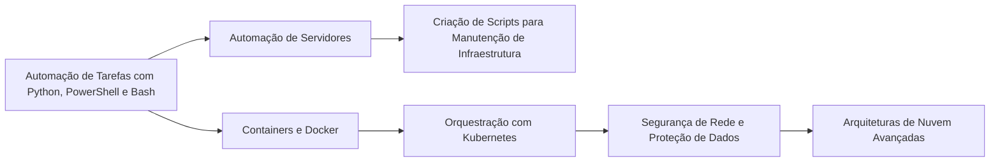

# <h1 align="center">Avançado Infraestrutura</h1>

## Bem-vindo(a) à jornada de aprendizado avançada em Infraestrutura de TI!  
&nbsp;&nbsp;&nbsp;&nbsp;Essa trilha foi criada para aqueles que já dominam os fundamentos e buscam aperfeiçoar suas habilidades em automação, containers, orquestração de containers, nuvem e segurança de rede. Aqui, você se aprofundará em Python, PowerShell, Bash, Docker, Kubernetes e aprenderá como aplicar esses conhecimentos para gerenciar, escalar e proteger ambientes de TI de maneira eficiente. Ao final dessa jornada, você estará preparado para assumir funções avançadas na infraestrutura de TI.  

# Avançado

1. **Automação e Python para Infraestrutura**
   **Curso: Python para Administradores de Sistema | Udemy**  
   Aprenda a automatizar tarefas de infraestrutura utilizando Python. Ideal para quem busca otimizar e melhorar a eficiência dos processos de TI.  
   [Python para Administradores de Sistema ](https://www.udemy.com/course/python-para-administradores-de-sistema/)

2. **PowerShell para Infraestrutura**
   **Curso: PowerShell para Administradores de Sistemas | Microsoft Learn**  
   Este curso ensina como usar o PowerShell para automatizar e administrar tarefas em servidores Windows.  
   [PowerShell para Administradores de Sistemas ](https://learn.microsoft.com/en-us/powershell/scripting/learn/)

3. **Bash para Infraestrutura**
   **Curso: Bash Scripting e Automação | Udemy**  
   Aprenda a usar o Bash para escrever scripts e automatizar tarefas em servidores Linux.  
   [Bash Scripting e Automação](https://www.udemy.com/course/bash-scripting-e-automacao/)

4. ** Containers e Docker**
   **Curso: Docker e Containers | Coursera**  
   Curso prático sobre Docker e containers, abordando como configurar, orquestrar e gerenciar containers no ambiente de TI.  
   [Docker e Containers ](https://www.coursera.org/learn/docker)  

5. ** Kubernetes para Orquestração de Containers**
   **Curso: Kubernetes para Iniciantes | Udemy**  
   Aprenda a utilizar Kubernetes para orquestrar containers, escalando aplicações e gerenciando clusters.  
   [Acesse o curso aqui](https://www.udemy.com/course/kubernetes-para-iniciantes/)

6. **Conceitos Avançados de Nuvem**
   **Curso: Certificação AWS - Arquitetura de Soluções | AWS Training**  
   Estudo aprofundado sobre arquitetura de soluções em nuvem com AWS, projetando sistemas escaláveis e resilientes.  
   [Kubernetes para Iniciantes](https://aws.amazon.com/training/)

7. **Segurança de Rede**
   **Curso: Segurança em Redes e Proteção de Dados | Coursera**  
   Curso focado em estratégias para garantir a segurança em redes corporativas e a proteção de dados em trânsito.  
   [Segurança em Redes e Proteção de Dados |](https://www.coursera.org/learn/redes-segurança)

---

## O que você deve saber ao final dessa trilha:

- **Automação com Python, PowerShell e Bash**  
  Capacidade de automatizar tarefas rotineiras, gerenciar servidores e realizar a manutenção de infraestruturas de forma eficiente.

- **Containers e Orquestração com Docker e Kubernetes**  
  Habilidade de criar, gerenciar e escalar containers e orquestrar aplicações em ambientes como Kubernetes.

- **Conceitos de Nuvem Avançados (AWS, Azure, Google Cloud)**  
  Domínio de arquiteturas em nuvem, escalabilidade, segurança e integração de soluções em plataformas como AWS e Azure.

- **Segurança de Rede**  
  Compreensão profunda de como proteger redes, identificar vulnerabilidades e aplicar medidas de segurança adequadas.

---

## Profissões que você pode seguir após essa trilha:

- Engenheiro de Infraestrutura
- Especialista em Automação de TI
- Administrador de Containers
- Arquitetura de Nuvem
- Engenheiro de Segurança de Rede
- DevOps

---

## Livros e Materiais Sugeridos

**Python para Administradores de Sistemas – Roderick W. Smith**  
↳ [Link Amazon](https://www.amazon.com.br/Python-para-Administradores-Sistemas-Roderick/dp/8535219753)

**Docker: A Beginner's Guide – Benjamin Smith**  
↳ [Link Amazon](https://www.amazon.com.br/Docker-Beginners-Guide-Benjamin-Smith/dp/1800209527)

**Kubernetes Up and Running – Kelsey Hightower**  
↳ [Link Amazon](https://www.amazon.com.br/Kubernetes-Up-Running-Containers-Production/dp/1491935677)

**Network Security Essentials – William Stallings**  
↳ [Link Amazon](https://www.amazon.com.br/Network-Security-Essentials-Applications-Standards/dp/013452733X)

---
---
## Orientações Finais
&nbsp;&nbsp;&nbsp;&nbsp;Após concluir os cursos, não deixe de realizar os exercícios. Temos um servidor exclusivo para Redes. Se você tem interesse em participar, cadastre-se em nosso site e em seguida, fala o laboratório do módulo. Após concluir, publique sobre sua experiência e marque a @Hive.connect no LinkedIn. Assim, iremos atribuir um cargo específico para você e garantir sua entrada no fórum exclusivo de Segurança da Informação.Temos diversas atividades em grupo focadas na área de Segurança da Informação, além de oferecer mentoria 1:1 e consultoria gratuita para currículos e perfis no LinkedIn.
&nbsp;&nbsp;&nbsp;&nbsp;Esta foi uma introdução essencial ao tema, que servirá como base para os próximos módulos. No próximo, vamos explorar ferramentas que ajudarão a aplicar esses conceitos na prática e aprimorar suas habilidades na área. Sempre compartilhe seus novos certificados no LinkedIn para aumentar sua visibilidade e destacar seu desenvolvimento profissional.  

---  

## Vamos juntos fortalecer o conhecimento, Hive.Connect uma comunidade de todos, para todos!
