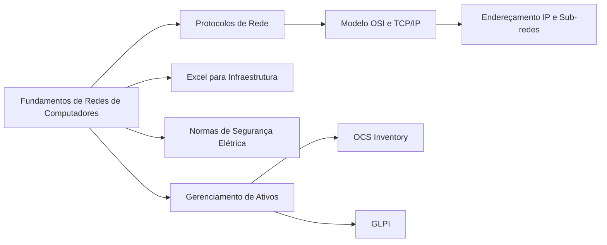
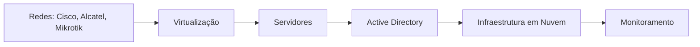
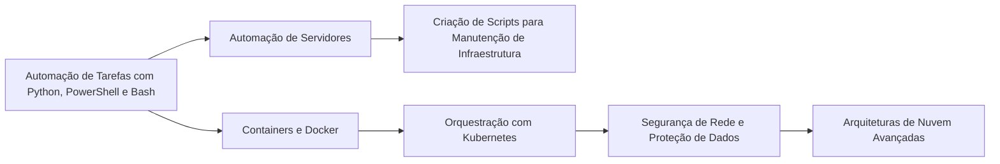

<h1 align="center">HIVE.CONNECT</h1>

  
  <h1 align="center">Infraestrutura</h1>

## Objetivo
&nbsp;&nbsp;&nbsp;&nbsp;O objetivo desta trilha é te capacitar para entrar no mercado de infraestruturas/redes, saindo do completo zero em infraestrutura de TI e alcançar a habilidade de:

→ **Configurar e administrar servidores e redes**;  
→ **Gerenciar ativos de TI e garantir a disponibilidade dos serviços**;  
→ **Implementar boas práticas de segurança e automação.**  

## Perfil de um Profissional de Infraestrutura
&nbsp;&nbsp;&nbsp;&nbsp;Quem trabalha com infraestrutura de TI precisa ter um perfil analítico, organizado e resiliente, já que lida diretamente com disponibilidade, desempenho e segurança dos sistemas. Além disso, a capacidade de resolver problemas sob pressão é essencial.
Infraestrutura lida com a parte física e virtual de diversos equipamentos. Muitas vezes, o profissional da área precisa ter alta disponibilidade para verificar presencialmente os equipamentos, especialmente em situações de emergência, que podem ocorrer mesmo fora do horário comercial. Além disso, alterações no ambiente são geralmente realizadas após o expediente para evitar impactos nas operações da empresa.
  
  Principais Características:

- **Pensamento Analítico:** Diagnostica falhas rapidamente e toma decisões assertivas.  
- **Disponibilidade:** Alta, podendo ser necessário atuar fora do horário comercial.  
- **Resiliência:** Lida com pressão, incidentes e emergências sem perder o controle.  
- **Atenção aos Detalhes:** Pequenos erros podem causar grandes problemas na infraestrutura.  
- **Organização:** Mantém documentação, configurações e processos bem estruturados.  
- **Trabalho em Equipe:** Atua em conjunto com times de segurança, redes, desenvolvimento e suporte.  
- **Senso de Urgência:** Resolve incidentes rapidamente para evitar downtime.  
- **Foco em Automação:** Busca otimizar processos repetitivos para ganhar eficiência.

## Habilidades Técnicas Importantes:
- **Sistemas Operacionais:** Administração de **Linux** e **Windows Server**  
- **Redes:** Configuração de **VLANs, VPNs, firewalls e roteadores**  
- **Servidores:** Gerenciamento de **Active Directory, DNS, DHCP**  
- **Cloud Computing:** Experiência com **AWS, Azure, GCP**  
- **Virtualização:** Uso de **VMware, Hyper-V, Proxmox**  
- **Monitoramento:** Ferramentas como **Zabbix, Prometheus, Grafana**  
- **Automação:** Scripts em **PowerShell, Bash, Python, Ansible**  
- **Contêineres:** Uso de **Docker e Kubernetes**  

## Áreas principais:
- **Analista de Infraestrutura**  
- **Cabeamento**  
- **NOC**  
- **Administrador de Servidores**  
- **Virtualização**  
- **Administrador de Redes**  
- **DevOps**  
- **Infraestrutura em Nuvem**  
- **Network Engineer**

## Título para LinkedIn:

**Infraestrutura de TI | Redes | Administração de Sistemas | Virtualização | Linux | Suporte Técnico | CCNA em andamento | Certificação LPIC-1**  
   
**Infraestrutura | Suporte e Redes | Administração de Servidores | Linux | Cloud Computing | Certificação AWS | CCNP em andamento | ITIL**  
   
**Infraestrutura de TI | Redes | Segurança de Sistemas | Suporte Técnico | Windows Server | CCNA | ITIL Foundation | Certificação LPIC-1 em andamento**  
   
**Infraestrutura de TI | Administração de Redes | Cloud Solutions | Suporte Técnico | Certificação VMware | CCNA | Microsoft Certified Solutions Associate (MCSA)**  

- **Esses são apenas alguns exemplos. Você pode criar o seu título personalizado seguindo a mesma estrutura: escolha a área que deseja atuar, destaque uma especialização dentro dessa área, inclua uma ferramenta importante relacionada e mencione uma certificação que está em processo de obtenção. Essa abordagem é chave para o sucesso.**

___
## O que você verá em cada módulo:</h1>
<h1 align="center">Iniciante</h1>

<h1 align="center">Intermediário</h1>

<h1 align="center">Avançado</h1>

---

## Links Importantes para Infraestrutura de TI

| Categoria | Nome | Descrição | Link |
| :---: | :---: | :--- | :---: |
| **Monitoramento** | UptimeRobot | Ferramenta gratuita para monitorar uptime de sites e serviços | [UptimeRobot](https://uptimerobot.com/) |
| **Monitoramento** | Zabbix | Plataforma de monitoramento de rede e infraestrutura, muito utilizada em ambientes corporativos | [Zabbix](https://www.zabbix.com/) |
| **Documentação** | Draw.io | Ferramenta online para criação de diagramas de rede, fluxos e arquitetura | [Draw.io](https://app.diagrams.net/) |
| **Automação** | Ansible | Ferramenta de automação de configuração e provisionamento de servidores | [Ansible](https://www.ansible.com/) |
| **Automação** | Terraform | Infraestrutura como código (IaC) para provisionamento automatizado em nuvem | [Terraform](https://www.terraform.io/) |
| **Controle de Acesso** | phpIPAM | Ferramenta de gerenciamento de IPs (IP Address Management) | [phpIPAM](https://phpipam.net/) |
| **Ferramenta Web** | WhatIsMyIP | Mostra o IP público e informações de rede | [WhatIsMyIP](https://whatismyipaddress.com/) |
| **Inventário** | GLPI | Sistema de gerenciamento de ativos, inventário e helpdesk | [GLPI](https://glpi-project.org/) |
| **Repositório** | Awesome SysAdmin | Lista de recursos para administradores de sistemas, incluindo ferramentas e boas práticas | [Awesome SysAdmin](https://github.com/awesome-foss/awesome-sysadmin) |
| **Backup** | Veeam | Soluções profissionais para backup e recuperação de dados | [Veeam](https://www.veeam.com/) |
| **Infraestrutura em Nuvem** | AWS Free Tier | Acesso gratuito a diversos serviços AWS para testes e aprendizado | [AWS Free Tier](https://aws.amazon.com/free/) |
| **Infraestrutura em Nuvem** | Azure Free Account | Crie conta gratuita na Azure com créditos para testar serviços | [Azure Free Account](https://azure.microsoft.com/en-us/free/) |

---

<h1 align="center">Pós-Graduações em Redes/Infraestrutura/DevOps</h1>

### USP (LARC)
- [MBA em Infraestrutura de TI e Gerenciamento de Redes (EAD)](https://cursos.larc.usp.br/mba-infraestrutura-ti/)

### FIAP  
- [Pós-Graduação em Redes e Infraestrutura de TI](https://postech.fiap.com.br/curso/redes-e-infraestrutura-ti/)  
- [Pós-Graduação em DevOps e Automação de Infraestrutura](https://postech.fiap.com.br/curso/devops-e-automacao-de-infraestrutura/)

### PUC-SP  
- [Pós-Graduação em Administração de Redes e Sistemas](https://www.pucsp.br/pos-graduacao/administracao-de-redes-e-sistemas/)

### SENAI  
- [Pós-Graduação em Infraestrutura de TI e Governança](https://www.sp.senai.br/cursos/infraestrutura-de-ti-e-governanca)

### XP Educação  
- [Pós-graduação em Infraestrutura e Arquitetura de TI](https://www.xpeducacao.com.br/pos-graduacao/infraestrutura-arquitetura-ti)

### Nova School of Business and Economics  
- [Pós-Graduação Online em Gestão de Infraestruturas e Cloud Computing](https://www.novasbe.unl.pt/pt/cursos/formacao-de-executivos/programas-abertos/infraestrutura-cloud/gestao-de-infraestruturas-cloud-computing)

### IBTA  
- [Pós-Graduação em DevOps e Gestão de Infraestrutura em Cloud](https://www.ibta.edu.br/pos-graduacao/devops-gestao-infraestrutura-cloud)

## Certificações

→ **CompTIA Network+** - Para quem está começando na área de redes.  
→ **CompTIA Server+** - Focada em administração de servidores e infraestrutura de TI.  
→ **Cisco CCNA** - Certificação essencial para quem deseja trabalhar com redes e roteadores Cisco.  
→ **Cisco CCNP** - Avançada para quem busca especialização em redes e infraestrutura Cisco.  
→ **Microsoft Certified: Azure Fundamentals** - Para iniciantes em infraestrutura de nuvem com o Azure.  
→ **Microsoft Certified: Azure Administrator Associate** - Para administradores de sistemas em Azure.  
→ **AWS Certified Solutions Architect – Associate** - Para quem trabalha com arquitetura e infraestrutura em nuvem na AWS.  
→ **AWS Certified DevOps Engineer – Professional** - Para profissionais focados em DevOps e automação na AWS.  
→ **Certified Kubernetes Administrator (CKA)** - Para administradores de sistemas que trabalham com Kubernetes.  
→ **Red Hat Certified Engineer (RHCE)** - Para profissionais que querem se especializar em administração de sistemas Linux e servidores.  
→ **VMware Certified Professional (VCP)** - Para quem trabalha com virtualização e administração de ambientes VMware.  
→ **Google Cloud Professional Cloud Architect** - Para arquitetos de soluções em Google Cloud.  
→ **HashiCorp Certified: Terraform Associate** - Para quem trabalha com automação de infraestrutura usando Terraform.  
→ **Certified DevOps Engineer – AWS** - Focada em automação e práticas de DevOps na AWS.  
→ **Cisco DevNet Associate** - Para quem trabalha com automação de rede e desenvolvimento de aplicativos de rede.  
→ **CompTIA Linux+** - Para administradores de sistemas que buscam especialização em Linux.  
→ **Certified Jenkins Engineer** - Para quem se especializa em automação contínua com Jenkins.  
→ **LPCI 1 (Licensed Penetration Tester - Level 1)** - Certificação focada em testes de penetração e segurança de redes.  
→ **LPCI 2 (Licensed Penetration Tester - Level 2)** - Para profissionais que buscam um nível avançado de especialização em testes de penetração e segurança.  

---

## Canais no YouTube sobre Infraestrutura de TI

- [Gustavo Kalau](https://www.youtube.com/c/GustavoKalau)  
  Conteúdo voltado para infraestrutura, redes, servidores Windows/Linux, virtualização, cloud e certificações como CompTIA, MTA e ITIL.

- [David Bombal](https://www.youtube.com/c/DavidBombal)  
  Redes, automação com Python, Cisco, certificações e segurança em ambientes corporativos.

- [NetworkChuck](https://www.youtube.com/c/NetworkChuck)  
  Redes, infraestrutura, hacking ético, automação, café e TI explicada de forma prática e divertida.

- [Professor Ramos](https://www.youtube.com/c/ProfessorRamos)  
  Conteúdo em português com foco em redes, servidores, Windows, Linux, segurança da informação e certificações.

- [Dio - Digital Innovation One](https://www.youtube.com/c/digitalinnovationone)  
  Diversas trilhas de aprendizado, incluindo infraestrutura, cloud, devops e segurança.

- [Curso em Vídeo](https://www.youtube.com/c/CursoemVideo)  
  Curso de Redes de Computadores, Linux e muitos conteúdos gratuitos com linguagem acessível.

- [FreeCodeCamp.org](https://www.youtube.com/c/Freecodecamp)  
  Apesar do foco maior em programação, também há conteúdos sobre redes, sistemas operacionais, Linux e cloud.
---

**Vamos juntos fortalecer o conhecimento, Hive.Connect uma comunidade de todos, para todos!**  
