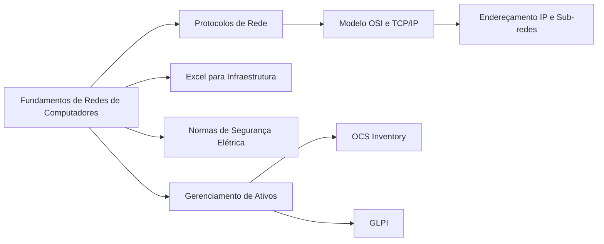

<h1 align="center">Iniciante Infraestrutura</h1>

## Bem-vindo(a) à jornada de aprendizado em Infraestrutura de TI!  
&nbsp;&nbsp;&nbsp;&nbsp;Essa trilha foi criada especialmente para quem está iniciando na área de infraestrutura e deseja adquirir uma base sólida em redes, organização de ativos e ferramentas essenciais para o dia a dia. Aqui você terá acesso a cursos da Cisco Networking Academy e outras plataformas confiáveis que te ajudarão a desenvolver as habilidades mais requisitadas no mercado de tecnologia.  
&nbsp;&nbsp;&nbsp;&nbsp;Após concluir os cursos, você poderá colocar em prática seu aprendizado em laboratórios simulados e ferramentas reais, como GLPI e OCS. Em caso de dúvidas, participe do nosso servidor no Discord e troque experiências com a comunidade.

## Iniciante

1. **Fundamentos de Redes de Computadores**  
   **Cisco - Introdução às Redes**  
   Curso oficial da Cisco que cobre os conceitos básicos de redes, hardware, cabos, switches e roteadores.  
   [Acesse o curso aqui](https://www.cisco.com/c/en/us/training-events/training-certifications/training.html)

2. **Protocolos de Rede**  
   **Curso: Fundamentos de Rede (Modelo OSI, TCP/IP, DHCP, DNS)**  
   Práticas com protocolos, análise de pacotes e simulações com o Cisco Packet Tracer.  
   [Acesse o curso aqui](https://www.cisco.com/c/en/us/solutions/collateral/enterprise-networks/packet-tracer/overview.html)

3. **Modelo OSI e TCP/IP**  
   **Networking Basics | Cisco SkillsForAll**  
   Curso com foco prático nos modelos OSI e TCP/IP e seus protocolos.  
   [Acesse o curso aqui](https://www.netacad.com/courses/packet-tracer)

4. **Endereçamento IP e Sub-redes**  
   **Curso Subnetting Made Easy | Udemy**  
   Curso simples e direto para entender subnetting e cálculo de IP.  
   [Acesse o curso aqui](https://www.udemy.com/course/subnetting-made-easy/)

5. **Excel para Infraestrutura**  
   **Curso de Excel para TI | YouTube - WR Educacional**  
   Voltado ao uso do Excel em inventários, relatórios e controle de ativos.  
   [Acesse o curso aqui](https://www.youtube.com/watch?v=4NbbgUe_-9I)

6. **Normas de Segurança Elétrica**  
   **NR-10 Básico Gratuito | Prime Cursos**  
   Curso gratuito com certificado, essencial para quem lida com cabos, instalações e racks.  
   [Acesse o curso aqui](https://www.primecursos.com.br/curso-gratuito/nr-10)

7. **Gerenciamento de Ativos**

   - **OCS Inventory**  
     [OCS Inventory – Documentação Oficial](https://ocsinventory-ng.org/documentation/)
     [Como instalar e configurar o OCS | YouTube](https://www.youtube.com/watch?v=abc123)

   - **GLPI**  
     [GLPI para Iniciantes – Curso Completo](https://www.youtube.com/watch?v=xyz987)
     [Instalação e Integração GLPI + OCS](https://www.youtube.com/watch?v=def456)

---

## O que você deve saber ao final dessa trilha:

- **Protocolos de Rede e Endereçamento IP**  
   Compreensão sólida de como os dispositivos se comunicam em rede, configurando IPs, sub-redes e entendendo o tráfego de pacotes.

- **Normas de Segurança Elétrica (NR-10)**  
   Noções básicas de segurança ao lidar com cabeamentos e equipamentos energizados.

- **Excel aplicado à Infraestrutura**  
   Capacidade de criar planilhas de controle de ativos, redes, IPs e manutenção.

- **Gerenciamento de Ativos com OCS e GLPI**  
   Habilidade de implementar e usar ferramentas para inventário, chamados e gestão de equipamentos de TI.

---

## Profissões que você pode seguir após essa trilha:

- Suporte Técnico Nível 1  
- Técnico de Redes  
- Auxiliar de Infraestrutura  
- Analista de Inventário/Ativos  
- Técnico de Campo  

---

## Livros e Materiais Sugeridos

**Redes de Computadores – Andrew Tanenbaum**  
↳ [Link Amazon](https://www.amazon.com.br/Redes-Computadores-Andrew-Tanenbaum/dp/8535245056)

**NR-10 Comentada – Segurança em Instalações Elétricas**  
↳ [Link Amazon](https://www.amazon.com.br/NR-10-Comentada-Seguran%C3%A7a-Instala%C3%A7%C3%B5es-El%C3%A9tricas/dp/8597019826)

**Excel para Área Técnica**  
↳ [Link Amazon](https://www.amazon.com.br/Excel-para-%C3%81rea-T%C3%A9cnica/dp/8535214295)

**Gestão de Serviços com GLPI**  
↳ [Link Amazon](https://www.amazon.com.br/Gest%C3%A3o-Servi%C3%A7os-GLPI-Inform%C3%A1tica-Computadores/dp/8574558082)

---
## Orientações Finais
&nbsp;&nbsp;&nbsp;&nbsp;Após concluir os cursos, não deixe de realizar os exercícios. Temos um servidor exclusivo para Redes. Se você tem interesse em participar, cadastre-se em nosso site e em seguida, fala o laboratório do módulo. Após concluir, publique sobre sua experiência e marque a @Hive.connect no LinkedIn. Assim, iremos atribuir um cargo específico para você e garantir sua entrada no fórum exclusivo de Segurança da Informação.Temos diversas atividades em grupo focadas na área de Segurança da Informação, além de oferecer mentoria 1:1 e consultoria gratuita para currículos e perfis no LinkedIn.
&nbsp;&nbsp;&nbsp;&nbsp;Esta foi uma introdução essencial ao tema, que servirá como base para os próximos módulos. No próximo, vamos explorar ferramentas que ajudarão a aplicar esses conceitos na prática e aprimorar suas habilidades na área. Sempre compartilhe seus novos certificados no LinkedIn para aumentar sua visibilidade e destacar seu desenvolvimento profissional.  

---  

## Vamos juntos fortalecer o conhecimento, Hive.Connect uma comunidade de todos, para todos!
